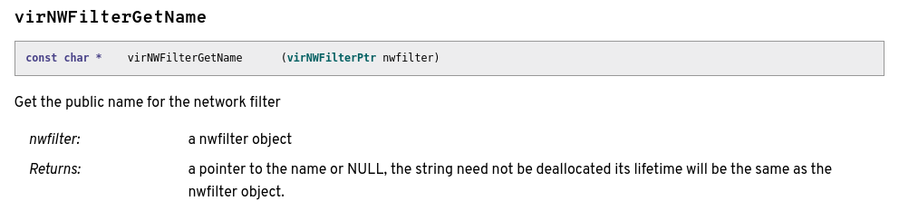
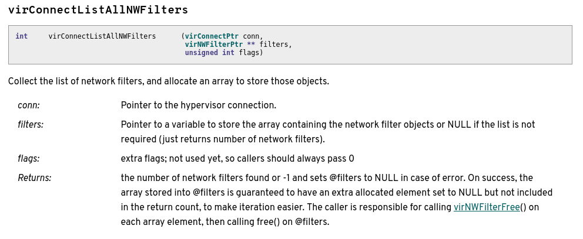
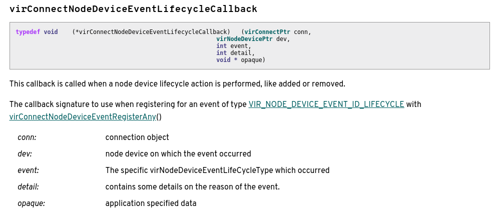
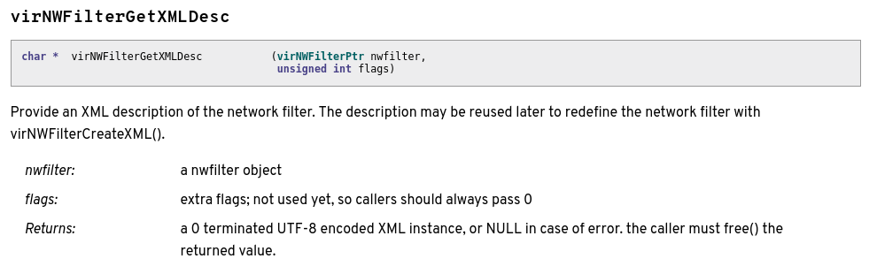

# libvirt-dbus
* [Directories](libvirt-dbus.md#directories)
* [Building from Source](libvirt-dbus.md#building-from-source)
* [Running from Source](libvirt-dbus.md#running-from-source)
* [busctl](libvirt-dbus.md#busctl)
    * [Command Structure](libvirt-dbus.md#command-structure)
    * [Notable OPTIONS](libvirt-dbus.md#notable-options)
    * [Noteable COMMANDs](libvirt-dbus.md#noteable-commands)
    * [D-Bus Types](libvirt-dbus.md#d-bus-types)
* [Testing](libvirt-dbus.md#testing)
* [Adding an Interface](libvirt-dbus.md#adding-an-interface)
    * [Introducing the Interface](libvirt-dbus.md#introducing-the-interface)
    * [Properties](libvirt-dbus.md#properties)
    * [Connect Methods](libvirt-dbus.md#connect-methods)
        * [Key Features](libvirt-dbus.md#key-features-connect-methods)
    * [Events](libvirt-dbus.md#events)
    * [Interface Methods](libvirt-dbus.md#interface-methods)
        * [Key Features](libvirt-dbus.md#key-features-interface-methods)
* [Understanding `gdbus.h` in the Context of Interfaces](libvirt-dbus.md#understanding-gdbush-in-the-context-of-interfaces)

D-Bus is a communication protocol

There is a system bus connection which is used to communicate with system level things such as NetworkManager and processes started by systemd and a session bus connection which is dedicated to each user and communicates with user processes

libvirt-dbus wraps libvirt API to provide a high-level object-oriented API better suited for dbus-based applications

### Directories
* `data` has the `org.libvirt.Interface.xml` file for every interface
* `src` is all of the source code  
    * contains a `.h` and `.c` file for every interface
    * `gdbus.c` and `util.c` are key files
* `tests` has the tests (pytest)

### Building from Source
1. Run `./autogen.sh` which turns the configure file into a script (and maybe runs it?)

2. Running `./configure` generates make files from the make file templates  
These scripts require some packages to run. Install these by running these two commands:
    ```
    $  sudo yum builddep libvirt-dbus
    ```
    * we created a `configuresystem.sh` script to run `./configure` with the appropriate parameters (see [Arbitrary Tasks Reference](reference_arbitrarytasks.md))
3. There are a couple of notable "make" commands:
    * `make` just compiles all of the code
    * `make check` compiles the code and runs the test suite on it
    * `make syntax-check` compiles all the code and checks for variations from coding conventions such as hanging white space etc.

  >**Note:**  
  NEVER run "sudo make" because then all of the make files will require root permissions.  
  Also, NEVER install it, always just run it from source (in this case, the git repo)  

### Running from Source
Prep Step:  
Put the following xml into the `/etc/dbus-1/system.d/org.libvirt.conf` file so that you can run the system bus connection from your non-root account:
``` xml
<?xml version="1.0"?>
<!DOCTYPE busconfig PUBLIC "-//freedesktop//DTD D-BUS Bus Configuration 1.0//EN"
 "http://www.freedesktop.org/standards/dbus/1.0/busconfig.dtd">

<busconfig>

  <policy user="aharter">
    <allow send_destination="org.libvirt"/>
    <allow own="org.libvirt"/>
  </policy>

</busconfig>
```

To run libvirt-dbus with a **system** bus connection, run the following command from inside the top directory of the git repo
```
$  ./run src/libvirt-dbus --system
```

To run libvirt-dbus with a **session** bus connection, run the following command from inside the top directory of the git repo
```
$  ./run src/libvirt-dbus --session
```

>To see if it is running, run
`ps axwww | grep libvirt-dbus`.

>From here you can see where it is running from (either `/usr/bin/libvirt-dbus` or `src/libvirt-dbus`).  

>To kill it, you can try running
`killall libvirt-dbus` or `sudo killall libvirt-dbus`
or if that fails
`killall -9 <pid>`

### busctl
We will use busctl to send commands to libvirt-dbus (although gdbus is what is in the reference documentation for libvirt-dbus https://libvirt.org/dbus.html)

https://www.freedesktop.org/software/systemd/man/busctl.html

#### Command Structure

```
busctl [OPTIONS...] {COMMAND} ...
```

The COMMAND part of the string is usually made up of the name of the busctl command followed by a series of required and optional parameters:
* `SERVICE`: which daemon you are interacting with (in this case `org.libvirt`)
* `OBJECT`: the object path (`/org/libvirt/QEMU/domain/_90157a79_649c_4db6_9ebe_715ea57b336b` - domain object or `/org/libvirt/Test` - connect object)
* `INTERFACE`: introspect, properties, or one of our own such as `org.libvirt.Domain`
* `METHOD`: method name
* `SIGNATURE`: type of argument
* `ARGUMENT`: argument
* `PROPERTY`: property name in string format

#### Notable OPTIONS
* `--system`: connect to system bus
* `--user`: connect to user (session) bus

#### Noteable COMMANDs
* `tree [SERVICE...]`: show object tree of service

    ```
    $ busctl --system tree org.libvirt
    ```

* `introspect SERVICE OBJECT [INTERFACE]`: show interfaces, methods, properties and signals of the object

    ```
    $ busctl --system introspect org.libvirt /org/libvirt/QEMU/domain/_90157a79_649c_4db6_9ebe_715ea57b336b
    ```

* `call SERVICE OBJECT INTERFACE METHOD [SIGNATURE [ARGUMENT...]]`: call a method

    ```
    $ busctl --system call org.libvirt /org/libvirt/QEMU/domain/_90157a79_649c_4db6_9ebe_715ea57b336b org.libvirt.Domain GetXMLDesc u 0
    ```
    ```
    $ busctl --system call org.libvirt /org/libvirt/QEMU/domain/_90157a79_649c_4db6_9ebe_715ea57b336b org.libvirt.Domain SetUserPassword ssu username password 0
    ```

* `get-property SERVICE OBJECT INTERFACE PROPERTY...`: get property value

    ```
    $ busctl --system get-property org.libvirt /org/libvirt/QEMU/domain/_90157a79_649c_4db6_9ebe_715ea57b336b org.libvirt.Domain "Name"
    ```

#### D-Bus Types
The SIGNATUREs are formatted based on the D-Bus type system which is documented here:
https://dbus.freedesktop.org/doc/dbus-specification.html#type-system

I have outlined the basics here

| Character | Conventional Name |
| --------- | ----------------- |
| `y`       | BYTE              |
| `b`       | BOOLEAN           |
| `n`       | INT16             |
| `q`       | UINT16            |
| `i`       | INT32             |
| `u`       | UINT32            |
| `x`       | INT64             |
| `t`       | UINT64            |
| `d`       | DOUBLE            |
| `s`       | STRING            |
| `o`       | OBJECT\_PATH      |
| `g`       | SIGNATURE         |
| `a`       | ARRAY             |
| `(` `)`   | STRUCT            |
| `v`       | VARIANT           |
| `{` `}`   | DICT\_ENTRY       |
| `h`       | UNIX_FD           |

### Testing
The tests are in the form of pytests

The testing is done only for APIs that are implemented by "test" driver in libvirt (`src/test/test_driver.c`) because that driver is used to run the tests and not every API is implemented

Each `test_{object}.py` file is executable and the test itself, you need to have one class there and every method that starts with "test_" is a test case

You can run each test by executing `./run tests/test_connect.py` and it also takes some parameters, for example `./run tests/test_connect.py -v` will increase verbosity, you can also use `--help` as parameter

### Adding an Interface

There are three main parts of adding an interface to libvirt-dbus: introducing the interface, implementing the properties, and implementing the methods (in the interface file and in `connect.c`).

Each interface module is laid out in the libvirt documentation (https://libvirt.org/html).

For a given interface, these are the guidelines that I use to identify the properties, connect methods, events methods, and interface methods, all of which are represented as functions.

#### Introducing the Interface
We will use NWFilter as an example.

1. Create a new file `data/org.libvirt.NWFilter.xml`

    ``` xml
    <!DOCTYPE node PUBLIC "-//freedesktop//DTD D-BUS Object Introspection 1.0//EN"
    "http://www.freedesktop.org/standards/dbus/1.0/introspect.dtd">

    <node name="/org/libvirt/nwfilter">
      <interface name="org.libvirt.NWFilter">
      </interface>
    </node>
    ```

    and add it to `data/Makefile.am`

    ``` diff
    @@ -22,7 +22,8 @@ interfaces_files = \
         org.libvirt.Connect.xml \
         org.libvirt.Domain.xml \
         org.libvirt.Network.xml \
    +    org.libvirt.NWFilter.xml \
         org.libvirt.Secret.xml \
         org.libvirt.StoragePool.xml \
         $(NULL)
     interfacesdir = $(DBUS_INTERFACES_DIR)
    ```

2. Create files `src/nwfilter.c` and `src/nwfilter.h` and add them to `src/Makefile.am`:
    ``` diff
    @@ -44,6 +44,8 @@ DAEMON_SOURCES = \
         main.c \
         network.c \
         network.h \
    +    nwfilter.c \
    +    nwfilter.h \
         secret.c \
         secret.h \
         storagepool.c \
    ```

3. In `src/connect.c`, include the new header file

    ``` diff
    @@ -2,6 +2,7 @@
     #include "domain.h"
     #include "events.h"
     #include "network.h"
    +#include "nwfilter.h"
     #include "secret.h"
     #include "storagepool.h"
     #include "util.h"
    ```

    add a line to `virtDBusConnectFree()` for the path attribute you will create in `connect.h`

    ``` diff
    @@ -1394,6 +1395,7 @@ virtDBusConnectFree(virtDBusConnect *connect)

         g_free(connect->domainPath);
         g_free(connect->networkPath);
    +    g_free(connect->nwfilterPath);
         g_free(connect->secretPath);
         g_free(connect->storagePoolPath);
         g_free(connect);
    ```

    and add a call to a new Register function in `virtDBusConnectNew()`

    ``` diff
    @@ -1451,6 +1453,10 @@ virtDBusConnectNew(virtDBusConnect **connectp,
         if (error && *error)
             return;

    +    virtDBusNWFilterRegister(connect, error);
    +    if (error && *error)
    +        return;
    +
         virtDBusSecretRegister(connect, error);
         if (error && *error)
             return;
    ```

4. In `src/connect.h`, add this line inside `struct virtDBusConnect{}` to create a new path attribute for this interface

    ``` diff
    @@ -14,6 +14,7 @@ struct virtDBusConnect {
         const gchar *connectPath;
         gchar *domainPath;
         gchar *networkPath;
    +    gchar *nwfilterPath;
         gchar *secretPath;
         gchar *storagePoolPath;
         virConnectPtr connection;
    ```

5. The contents of `src/nwfilter.c` should look like this:

    ``` c
    #include "nwfilter.h"
    #include "util.h"

    #include <libvirt/libvirt.h>

    static virNWFilterPtr
    virtDBusNWFilterGetVirNWFilter(virtDBusConnect *connect,
                                   const gchar *objectPath,
                                   GError **error)
    {
        virNWFilterPtr nwfilter;

        if (virtDBusConnectOpen(connect, error) < 0)
            return NULL;

        nwfilter = virtDBusUtilVirNWFilterFromBusPath(connect->connection,
                                                      objectPath,
                                                      connect->nwfilterPath);
        if (!nwfilter) {
            virtDBusUtilSetLastVirtError(error);
            return NULL;
        }

        return nwfilter;
    }

    static virtDBusGDBusPropertyTable virtDBusNWFilterPropertyTable[] = {
        { 0 }
    };

    static virtDBusGDBusMethodTable virtDBusNWFilterMethodTable[] = {
        { 0 }
    };

    static gchar **
    virtDBusNWFilterEnumerate(gpointer userData)
    {
        virtDBusConnect *connect = userData;
        g_autoptr(virNWFilterPtr) nwfilters = NULL;
        gint num = 0;
        gchar **ret = NULL;

        if (!virtDBusConnectOpen(connect, NULL))
            return NULL;

        num = virConnectListAllNWFilters(connect->connection, &nwfilters, 0);
        if (num < 0)
            return NULL;

        if (num == 0)
            return NULL;

        ret = g_new0(gchar *, num + 1);

        for (gint i = 0; i < num; i++) {
            ret[i] = virtDBusUtilBusPathForVirNWFilter(nwfilters[i],
                                                       connect->nwfilterPath);
        }

        return ret;
    }

    static GDBusInterfaceInfo *interfaceInfo;

    void
    virtDBusNWFilterRegister(virtDBusConnect *connect,
                             GError **error)
    {
        connect->nwfilterPath = g_strdup_printf("%s/nwfilter",
                                                connect->connectPath);

        if (!interfaceInfo) {
            interfaceInfo = virtDBusGDBusLoadIntrospectData(VIRT_DBUS_NWFILTER_INTERFACE,
                                                            error);
            if (!interfaceInfo)
                return;
        }

        virtDBusGDBusRegisterSubtree(connect->bus,
                                     connect->nwfilterPath,
                                     interfaceInfo,
                                     virtDBusNWFilterEnumerate,
                                     virtDBusNWFilterMethodTable,
                                     virtDBusNWFilterPropertyTable,
                                     connect);
    }
    ```

6. The contents of `src/nwfilter.h` should look like this:

    ``` c
    #pragma once

    #include "connect.h"

    #define VIRT_DBUS_NWFILTER_INTERFACE "org.libvirt.NWFilter"

    void
    virtDBusNWFilterRegister(virtDBusConnect *connect,
                             GError **error);
    ```

7. In `src/util.c`, implement the following three functions (this block of code occurs in a series of similar blocks, one for each interface, in alphabetical order):

    ``` c
    virNWFilterPtr
    virtDBusUtilVirNWFilterFromBusPath(virConnectPtr connection,
                                       const gchar *path,
                                       const gchar *nwfilterPath)
    {
        g_autofree gchar *name = NULL;
        gsize prefixLen = strlen(nwfilterPath) + 1;

        name = virtDBusUtilDecodeUUID(path + prefixLen);

        return virNWFilterLookupByUUIDString(connection, name);
    }

    gchar *
    virtDBusUtilBusPathForVirNWFilter(virNWFilterPtr nwfilter,
                                      const gchar *nwfilterPath)
    {
        gchar uuid[VIR_UUID_STRING_BUFLEN] = "";
        g_autofree gchar *newUuid = NULL;
        virNWFilterGetUUIDString(nwfilter, uuid);
        newUuid = virtDBusUtilEncodeUUID(uuid);
        return g_strdup_printf("%s/%s", nwfilterPath, newUuid);
    }

    void
    virtDBusUtilVirNWFilterListFree(virNWFilterPtr *nwfilters)
    {
        for (gint i = 0; nwfilters[i] != NULL; i++)
            virNWFilterFree(nwfilters[i]);

        g_free(nwfilters);
    }
    ```

    * It appears that the default identifier used here is the UUID. In the case that the interface does not have a UUID property, another unique identifier with a lookup method is used (in libvirt/src/datatypes.h it has a comment saying unique next to it). For example, StorageVol uses a key so the two functions change as follows:

        ``` c
        virStorageVolPtr
        virtDBusUtilVirStorageVolFromBusPath(virConnectPtr connection,
                                             const gchar *path,
                                             const gchar *storageVolPath)
        {
            g_autofree gchar *key = NULL;
            gsize prefixLen = strlen(storageVolPath) + 1;

            key = virtDBusUtilDecodeStr(path + prefixLen);

            return virStorageVolLookupByKey(connection, key);
        }

        gchar *
        virtDBusUtilBusPathForVirStorageVol(virStorageVolPtr storageVol,
                                            const gchar *storageVolPath)
        {
            const gchar *key = NULL;
            g_autofree const gchar *encodedKey = NULL;

            key = virStorageVolGetKey(storageVol);
            encodedKey = virtDBusUtilEncodeStr(key);

            return g_strdup_printf("%s/%s", storageVolPath, encodedKey);
        }
        ```

8. In `src/util.h`, define the following five functions (this block of code occurs in a series of similar blocks, one for each interface, in alphabetical order):

    ``` c
    virNWFilterPtr
    virtDBusUtilVirNWFilterFromBusPath(virConnectPtr connection,
                                       const gchar *path,
                                       const gchar *nwfilterPath);

    gchar *
    virtDBusUtilBusPathForVirNWFilter(virNWFilterPtr nwfilter,
                                      const gchar *nwfilterPath);

    void
    virtDBusUtilVirNWFilterListFree(virNWFilterPtr *nwfilters);

    G_DEFINE_AUTOPTR_CLEANUP_FUNC(virNWFilter, virNWFilterFree);
    G_DEFINE_AUTOPTR_CLEANUP_FUNC(virNWFilterPtr, virtDBusUtilVirNWFilterListFree);
    ```

#### Properties
The properties come from two different parts of the libvirt code for the most part. But any method belonging to your interface which contains the word "Get", "Set", or "Is"; does not take any other pointers or flags as arguments; and whose first argument has type `vir<InterfaceName>Ptr` has the potential to be represented in the libvirt-dbus code as a property.

To find the code for the right interface try the following two commands from inside `libvirt/src`:  
`git grep 'struct _vir<InterfaceName> '`  
`git grep 'struct _vir<InterfaceName>Obj '`  

The code segments relevant to the Network properties are below as an example...

* `libvirt/src/datatypes.h` :

    ``` c
    /**
    * _virNetwork:
    *
    * Internal structure associated to a domain
    */
    struct _virNetwork {
        virObject parent;
        virConnectPtr conn;                  /* pointer back to the connection */
        char *name;                          /* the network external name */
        unsigned char uuid[VIR_UUID_BUFLEN]; /* the network unique identifier */
    };
    ```

    * the virObject and virConnectPtr lines are not put into the properties table referenced later

* `libvirt/src/conf/virnetworkobj.c` :

    ``` c
    struct _virNetworkObj {
        virObjectLockable parent;

        pid_t dnsmasqPid;
        pid_t radvdPid;
        bool active;
        bool autostart;
        bool persistent;

        virNetworkDefPtr def; /* The current definition */
        virNetworkDefPtr newDef; /* New definition to activate at shutdown */

        virBitmapPtr classIdMap; /* bitmap of class IDs for QoS */
        unsigned long long floor_sum; /* sum of all 'floor'-s of attached NICs */

        unsigned int taint;

        /* Immutable pointer, self locking APIs */
        virMacMapPtr macmap;
    };
    ```

    * the bool lines are really the properties that seem to be included

We will use [virNWFilterGetName](https://libvirt.org/html/libvirt-libvirt-nwfilter.html#virNWFilterGetName) as an example.

The reference documentation for this function is below for reference:
  

1. Add the corresponding xml to the `data/org.libvirt.NWFilter.xml` file inside the interface tag alphabetically with the rest of the properties.

    ``` xml
    <node name="/org/libvirt/nwfilter">
      <interface name="org.libvirt.NWFilter">
        <property name="Name" type="s" access="read">
          <annotation name="org.gtk.GDBus.DocString"
            value="See https://libvirt.org/html/libvirt-libvirt-nwfilter.html#virNWFilterGetName"/>
          <annotation name="org.freedesktop.DBus.Property.EmitsChangedSignal" value="const"/>
        </property>
        ...
      </interface>
    </node>
    ```

    * all properties are "read" by default unless there is a "Set" method in addition to the get method, in which case it is "readwrite" and the first annotation should reference both links (Domain(Get/Set)Autostart is a good example of implementing these)
    * the second annotation line is required for all types except "b" which is boolean
        * if there are any properties that is type boolean, the following line should go underneath the line with the interface tag:
        ``` xml
        <annotation name="org.freedesktop.DBus.Property.EmitsChangedSignal" value="false"/>
        ```
    * the type is corresponding to the [D-Bus Types](#d-bus-types)
        * `s`: string

2. Now we need to create a function in `src/nwfilter.c`. The model for implementing the method is to create a variable for the property and then call the original libvirt function. Each will be slightly different, but if you find a similar function, perhaps for a different interface, that can provide a good model.

    ``` c
    static void
    virtDBusNWFilterGetName(const gchar *objectPath,
                            gpointer userData,
                            GVariant **value,
                            GError **error)
    {
        virtDBusConnect *connect = userData;
        g_autoptr(virNWFilter) nwfilter = NULL;
        const gchar *name;

        nwfilter = virtDBusNWFilterGetVirNWFilter(connect, objectPath, error);
        if (!nwfilter)
            return;

        name = virNWFilterGetName(nwfilter);
        if (!name)
            return virtDBusUtilSetLastVirtError(error);

        *value = g_variant_new("s", name);
    }
    ```

3. The last step is to add a line for the function to the property table (it should be ordered alphabetically). The string is the property name as listed in `data/org.libvirt.NWFilter.xml`. The second part is the getter function. The last entry is the setter function or NULL if there is none.
    ``` c
    static virtDBusGDBusPropertyTable virtDBusNWFilterPropertyTable[] = {
        { "Name", virtDBusNWFilterGetName, NULL },
        { 0 }
    };
    ```

#### Connect Methods

The connect methods are easier to identify because their first argument should be of type virConnectPtr and sometimes their name starts with "virConnect". Methods with "Event" in the name are handled differently (see [Implementing Events Methods](#implementing-events-methods)).

We will use [virConnectListAllNWFilters](https://libvirt.org/html/libvirt-libvirt-nwfilter.html#virConnectListAllNWFilters) as an example.

The reference documentation for this function is below for reference:
  

1. Add the corresponding xml to the `data/org.libvirt.Connect.xml` file inside the interface tag alphabetically with the rest of the methods.

    ``` xml
        <method name="ListNWFilters">
          <annotation name="org.gtk.GDBus.DocString"
            value="See https://libvirt.org/html/libvirt-libvirt-nwfilter.html#virConnectListAllNWFilters"/>
          <arg name="flags" type="u" direction="in"/>
          <arg name="nwfilters" type="ao" direction="out"/>
        </method>
    ```

    * the parameters for the method are defined and explained in the documentation and should be labeled as "in" direction
        * Note: This example is a little tricky because in the documentation, there is an array passed in called "filters"; however, if you read the description you will see that it is just an empty pointer in which to store the results, so we don't have to include it in our in-direction arguments.
    * the name for the "out" direction argument is your choice but it should follow the specs for the return value of the method
        * Note: Since what we really need is the array, that should be the "out" argument
    * the type is corresponding to the [D-Bus Types](#d-bus-types)
        * `u`: guint32
        * `a`: array
        * `o`: valid DBus object path

2. Next we need to create a method in `src/connect.c` which is a wrapper that calls the actual libvirt function. The model for implementing the method is to create a variable for each of the parameters and one for the output. The output is a GVariant, so you will need to use a variant of the `g_variant_new` function. In the example below, a GVariantBuilder is used to form the array output from the method. Each will be slightly different, but if you find a similar function, perhaps for a different interface, that can provide a good model.

    ``` c
    static void
    virtDBusConnectListNWFilters(GVariant *inArgs,
                                 GUnixFDList *inFDs G_GNUC_UNUSED,
                                 const gchar *objectPath G_GNUC_UNUSED,
                                 gpointer userData,
                                 GVariant **outArgs,
                                 GUnixFDList **outFDs G_GNUC_UNUSED,
                                 GError **error)
    {
        virtDBusConnect *connect = userData;
        g_autoptr(virNWFilterPtr) nwfilters = NULL;
        guint flags;
        GVariantBuilder builder;
        GVariant *gnwfilters;

        g_variant_get(inArgs, "(u)", &flags);

        if (!virtDBusConnectOpen(connect, error))
            return;

        if (virConnectListAllNWFilters(connect->connection, &nwfilters, flags) < 0)
            return virtDBusUtilSetLastVirtError(error);

        g_variant_builder_init(&builder, G_VARIANT_TYPE("ao"));

        for (gint i = 0; nwfilters[i]; i++) {
            g_autofree gchar *path = NULL;
            path = virtDBusUtilBusPathForVirNWFilter(nwfilters[i],
                                                     connect->nwfilterPath);

            g_variant_builder_add(&builder, "o", path);
        }

        gnwfilters = g_variant_builder_end(&builder);
        *outArgs = g_variant_new_tuple(&gnwfilters, 1);
    }
    ```

3. The last step is to add a line for the function to the connect method table (it should be ordered alphabetically). The string is the method name as listed in `data/org.libvirt.Connect.xml`. The other half of the line is the method you just created which is what should be actually called when someone invokes the function name.
    ``` c
    static virtDBusGDBusMethodTable virtDBusConnectMethodTable[] = {
        ...
        { "ListNWFilters", virtDBusConnectListNWFilters },
        ...
        { 0 }
    };
    ```

##### Key Features (Connect Methods)

``` c
static void
virtDBusConnectMethodName(GVariant *inArgs [G_GNUC_UNUSED],
                          GUnixFDList *inFDs G_GNUC_UNUSED,
                          const gchar *objectPath G_GNUC_UNUSED,
                          gpointer userData,
                          GVariant **outArgs [G_GNUC_UNUSED],
                          GUnixFDList **outFDs G_GNUC_UNUSED,
                          GError **error)
{
    virtDBusConnect *connect = userData;

    // if (inArgs)
    gchar *arg1;
    guint arg2;

    g_variant_get(inArgs, "(&su)", &arg1, &arg2);
    // endif

    if (!virtDBusConnectOpen(connect, error))
        return;

    if (virConnectMethodName(connect->connection[, arg1, arg2]) < 0)
        return virtDBusUtilSetLastVirtError(error);

    // if (outArgs)
    path = virtDBusUtilBusPathForVirNetwork(network, connect->domainPath);  

    *outArgs = g_variant_new("(o)", path);
    // endif
}
```

#### Events

The event methods are identified by the word "Event" in the name. They generally take a connect pointer and are under the Connect interface but are handled as "signals" rather than "methods".

We will use [virConnectNodeDeviceEventLifecycleCallback](https://libvirt.org/html/libvirt-libvirt-nodedev.html#virConnectNodeDeviceEventLifecycleCallback) as an example.

The reference documentation for this function is below for reference:
  

1. Add the corresponding xml to the `data/org.libvirt.Connect.xml` file inside the interface tag alphabetically with the rest of the signals under the methods.

    ``` xml
        <signal name="NodeDeviceEvent">
          <annotation name="org.gtk.GDBus.DocString"
            value="See https://libvirt.org/html/libvirt-libvirt-nodedev.html#virConnectNodeDeviceEventLifecycleCallback"/>
          <arg name="dev" type="o"/>
          <arg name="event" type="i"/>
          <arg name="detail" type="i"/>
        </signal>
    ```

    * the parameters for the method are defined and explained in the documentation and should each have an `arg` tag
    * the type is corresponding to the [D-Bus Types](#d-bus-types)
        * `o`: valid DBus object path
        * `i`: gint32

2. In `src/connect.h`, add a line to create an array for the callback ids

    ``` diff
    @@ -24,6 +24,7 @@ struct virtDBusConnect {

         gint domainCallbackIds[VIR_DOMAIN_EVENT_ID_LAST];
         gint networkCallbackIds[VIR_NETWORK_EVENT_ID_LAST];
    +    gint devCallbackIds[VIR_NODE_DEVICE_EVENT_ID_LAST];
         gint secretCallbackIds[VIR_SECRET_EVENT_ID_LAST];
         gint storagePoolCallbackIds[VIR_STORAGE_POOL_EVENT_ID_LAST];
     };
    ```

3. In `src/connect.c`, add a for-loop to handle the node device events in `virtDBusConnectClose()`

    ``` diff
    @@ -65,6 +65,16 @@ virtDBusConnectClose(virtDBusConnect *connect,
             }
         }

    +    for (gint i = 0; i < VIR_NODE_DEVICE_EVENT_ID_LAST; i++) {
    +        if (connect->devCallbackIds[i] >= 0) {
    +            if (deregisterEvents) {
    +                virConnectNodeDeviceEventDeregisterAny(connect->connection,
    +                                                       connect->devCallbackIds[i]);
    +            }
    +            connect->devCallbackIds[i] = -1;
    +        }
    +    }
    +
         for (gint i = 0; i < VIR_SECRET_EVENT_ID_LAST; i++) {
             if (connect->secretCallbackIds[i] >= 0) {
                 if (deregisterEvents) {
    ```

    add a for-loop to handle the node device events in `virtDBusConnectNew()`

    ``` diff
    @@ -1744,6 +1754,9 @@ virtDBusConnectNew(virtDBusConnect **connectp,
         for (gint i = 0; i < VIR_NETWORK_EVENT_ID_LAST; i++)
             connect->networkCallbackIds[i] = -1;

    +    for (gint i = 0; i < VIR_NODE_DEVICE_EVENT_ID_LAST; i++)
    +        connect->devCallbackIds[i] = -1;
    +
         for (gint i = 0; i < VIR_SECRET_EVENT_ID_LAST; i++)
             connect->secretCallbackIds[i] = -1;
    ```

4. In `src/events.c`, create a new Event function

    ``` c
    static gint
    virtDBusEventsNodeDeviceEvent(virConnectPtr connection G_GNUC_UNUSED,
                                  virNodeDevicePtr dev,
                                  gint event,
                                  gint detail,
                                  gpointer opaque)
    {
        virtDBusConnect *connect = opaque;
        g_autofree gchar *path = NULL;

        path = virtDBusUtilBusPathForVirNodeDevice(dev, connect->nodeDevPath);

        g_dbus_connection_emit_signal(connect->bus,
                                      NULL,
                                      connect->connectPath,
                                      VIRT_DBUS_CONNECT_INTERFACE,
                                      "NodeDeviceEvent",
                                      g_variant_new("(oii)", path, event, detail),
                                      NULL);

        return 0;
    }
    ```

    create a new Register Event function

    ``` c
    static void
    virtDBusEventsRegisterNodeDeviceEvent(virtDBusConnect *connect,
                                          gint id,
                                          virConnectNodeDeviceEventGenericCallback callback)
    {
        g_assert(connect->nodeDevCallbackIds[id] == -1);

        connect->nodeDevCallbackIds[id] = virConnectNodeDeviceEventRegisterAny(connect->connection,
                                                                               NULL,
                                                                               id,
                                                                               VIR_NODE_DEVICE_EVENT_CALLBACK(callback),
                                                                               connect,
                                                                               NULL);
    }
    ```

    and add a call to the function above inside the `virtDBusEventsRegister()` function

    ``` diff
    @@ -791,6 +829,10 @@ virtDBusEventsRegister(virtDBusConnect *connect)
                                            VIR_NETWORK_EVENT_ID_LIFECYCLE,
                                            VIR_NETWORK_EVENT_CALLBACK(virtDBusEventsNetworkEvent));

    +    virtDBusEventsRegisterNodeDeviceEvent(connect,
    +                                          VIR_NODE_DEVICE_EVENT_ID_LIFECYCLE,
    +                                          VIR_NODE_DEVICE_EVENT_CALLBACK(virtDBusEventsNodeDeviceEvent));
    +
         virtDBusEventsRegisterSecretEvent(connect,
                                           VIR_SECRET_EVENT_ID_LIFECYCLE,
                                           VIR_SECRET_EVENT_CALLBACK(virtDBusEventsSecretEvent));
    ```

#### Interface Methods
The interface methods are anything that wasn't covered by the last three categories.

We will use [virNWFilterGetXMLDesc](https://libvirt.org/html/libvirt-libvirt-nwfilter.html#virNWFilterGetXMLDesc) as an example.

The reference documentation for this function is below for reference:
  

1. Add the corresponding xml to the `data/org.libvirt.NWFilter.xml` file inside the interface tag alphabetically with the rest of the methods after the properties.

    ``` xml
    <node name="/org/libvirt/nwfilter">
      <interface name="org.libvirt.NWFilter">
        ...
        <method name="GetXMLDesc">
          <annotation name="org.gtk.GDBus.DocString"
            value="See https://libvirt.org/html/libvirt-libvirt-nwfilter.html#virNWFilterGetXMLDesc"/>
          <arg name="flags" type="u" direction="in"/>
          <arg name="xml" type="s" direction="out"/>
        </method>
      </interface>
    </node>
    ```

    * the parameters for the method are defined and explained in the documentation and should be labeled as "in" direction
    * the name for the "out" direction argument is your choice but it should follow the specs for the return value of the method
    * the type is corresponding to the [D-Bus Types](#d-bus-types)
        * `u`: guint32
        * `s`: string

2. Now we need to create a function in `src/nwfilter.c`. The model for implementing the method is to create a variable for each of the parameters and one for the output. The output is a GVariant, so you will need to use a variant of the `g_variant_new` function. Each will be slightly different, but if you find a similar function, perhaps for a different interface, that can provide a good model.

    ``` c
    static void
    virtDBusNWFilterGetXMLDesc(GVariant *inArgs,
                               GUnixFDList *inFDs G_GNUC_UNUSED,
                               const gchar *objectPath,
                               gpointer userData,
                               GVariant **outArgs,
                               GUnixFDList **outFDs G_GNUC_UNUSED,
                               GError **error)
    {
        virtDBusConnect *connect = userData;
        g_autoptr(virNWFilter) nwfilter = NULL;
        g_autofree gchar *xml = NULL;
        guint flags;

        g_variant_get(inArgs, "(u)", &flags);

        nwfilter = virtDBusNWFilterGetVirNWFilter(connect, objectPath, error);
        if (!nwfilter)
            return;

        xml = virNWFilterGetXMLDesc(nwfilter, flags);
        if (!xml)
            return virtDBusUtilSetLastVirtError(error);

        *outArgs = g_variant_new("(s)", xml);
    }
    ```

3. The last step is to add a line for the function to the property table (it should be ordered alphabetically). The string is the method name as listed in `data/org.libvirt.NWFilter.xml`. The other half of the line is the method you just created.
    ``` c
    static virtDBusGDBusMethodTable virtDBusNWFilterMethodTable[] = {
        { "GetXMLDesc", virtDBusNWFilterGetXMLDesc },
        { 0 }
    };
    ```

##### Key Features (Interface Methods)

``` c
static void
virtDBusInterfaceNameMethodName(GVariant *inArgs [G_GNUC_UNUSED],
                                GUnixFDList *inFDs G_GNUC_UNUSED,
                                const gchar *objectPath,
                                gpointer userData,
                                GVariant **outArgs [G_GNUC_UNUSED],
                                GUnixFDList **outFDs G_GNUC_UNUSED,
                                GError **error)
{
    virtDBusConnect *connect = userData;
    g_autoptr(virInterfaceName) interfacename = NULL;
    g_autofree gchar *argout = NULL;       // if (outArgs)
    guint argin;                           // if (inArgs)

    g_variant_get(inArgs, "(u)", &argin);   // if (inArgs)

    interfacename = virtDBusInterfaceNameGetVirInterfaceName(connect, objectPath, error);
    if (!interfacename)
        return;

    // if (outArgs)
    argout = virInterfaceNameMethodName(interfacename, argin);
    if (!argout)
        return virtDBusUtilSetLastVirtError(error);

    *outArgs = g_variant_new("(s)", argout);
    // else
    if (virInterfaceNameMethodName(interfacename) < 0)
        virtDBusUtilSetLastVirtError(error);
    // end
}
```

### Understanding `gdbus.h` in the Context of Interfaces
`gdbus.c` connects the APIs we implement to the standard dbus API

I have combined the specification comments from the header and c file in the code below...
``` c
#pragma once

#include <gio/gio.h>
```
>The typedef below essentially is defining a class of function outlining an interface method. When implementing a function of this type, if a parameter is unused, it is followed by the G_GNUC_UNUSED attribute annotation.

``` c
/**
 * virtDBusGDBusMethodFunc:
 * @inArgs: input arguments of the method call
 * @inFDs: list of input file descriptors
 * @objectPath: the object path the method was called on
 * @userData: user data passed when registering new object or subtree
 * @outArgs: return location of output arguments
 * @outFDs: return location of output file descriptors
 * @error: return location for error
 *
 * Handles D-Bus method call.  In case of error the handler has
 * to set an @error.
 */
typedef void
(*virtDBusGDBusMethodFunc)(GVariant *inArgs,
                           GUnixFDList *inFDs,
                           const gchar *objectPath,
                           gpointer userData,
                           GVariant **outArgs,
                           GUnixFDList **outFDs,
                           GError **error);
```
>The typedef below essentially is defining a class of function outlining an interface GetProperty method.

``` c
/**
 * virtDBusGDBusPropertyGetFunc:
 * @objectPath: the object path the method was called on
 * @userData: user data passed when registering new object or subtree
 * @value: return location for property value
 * @error: return location for error
 *
 * Handles D-Bus Get action on a property.  In case of error the handler
 * has to set an @error, otherwise @value has to be set.
 */
typedef void
(*virtDBusGDBusPropertyGetFunc)(const gchar *objectPath,
                                gpointer userData,
                                GVariant **value,
                                GError **error);
```
>The typedef below essentially is defining a class of function outlining an interface SetProperty method.

``` c
/**
 * virtDBusGDBusPropertySetFunc:
 * @objectPath: the object path the method was called on
 * @value: new value that should be set to the property
 * @userData: user data passed when registering new object or subtree
 * @error: return location for error
 *
 * Handles D-Bus Set action on a property.  In case of error the handler
 * has to set an @error.
 */
typedef void
(*virtDBusGDBusPropertySetFunc)(GVariant *value,
                                const gchar *objectPath,
                                gpointer userData,
                                GError **error);
```
>The typedef below essentially is defining a class of function outlining an interface Enumerate method.

``` c
/**
 * virtDBusGDBusEnumerateFunc:
 * @userData: user data passed when registering new subtree
 *
 * Handles D-Bus introspection for subtree of objects.
 *
 * Returns a list of objects or NULL.
 */
typedef gchar **
(*virtDBusGDBusEnumerateFunc)(gpointer userData);
```
>The virtDBusGDBusMethodTable is defining a struct. There is an instance of this struct for every interface (including connect). The table contains an entry for every method belonging to that interface.

``` c
struct _virtDBusGDBusMethodTable {
    const gchar *name;
    virtDBusGDBusMethodFunc methodFunc;
};
typedef struct _virtDBusGDBusMethodTable virtDBusGDBusMethodTable;
```
>The virtDBusGDBusPropertyTable is defining a struct. There is an instance of this struct for every interface (including connect). The table contains an entry for every property belonging to that interface.

``` c
struct _virtDBusGDBusPropertyTable {
    const gchar *name;
    virtDBusGDBusPropertyGetFunc getFunc;
    virtDBusGDBusPropertySetFunc setFunc;
};
typedef struct _virtDBusGDBusPropertyTable virtDBusGDBusPropertyTable;
```
>Not really sure what these two typedefs below mean with regards to interfaces

``` c
typedef guint virtDBusGDBusSource;
typedef guint virtDBusGDBusOwner;
```
>The specification seems to explain the function below pretty well. This only has one implementation and takes interface-specific parameters.

``` c
/**
 * virtDBusGDBusLoadIntrospectData:
 * @interface: name of the interface
 * @error: return location for error
 *
 * Reads an interface XML description from file and returns new
 * interface info.  The caller owns an reference to the returned info.
 *
 * The file path is constructed as:
 *
 *  VIRT_DBUS_INTERFACES_DIR/{@interface}.xml
 *
 * Returns interface info on success, NULL on failure.
 */
GDBusInterfaceInfo *
virtDBusGDBusLoadIntrospectData(gchar const *interface,
                                GError **error);
```
>This function below is called by `connect.c` before it calls each of the interface-specific Register functions.

``` c
/**
 * virtDBusGDBusRegisterObject:
 * @bus: GDBus connection
 * @objectPath: object path
 * @interface: interface info of the object
 * @methods: table of method handlers
 * @properties: table of property handlers
 * @userData: data that are passed to method and property handlers
 *
 * Registers a new D-Bus object that we would like to handle.
 */
void
virtDBusGDBusRegisterObject(GDBusConnection *bus,
                            gchar const *objectPath,
                            GDBusInterfaceInfo *interface,
                            virtDBusGDBusMethodTable *methods,
                            virtDBusGDBusPropertyTable *properties,
                            gpointer userData);
```
>This function below is called within the virtDBus<Interface>Register function which exists for all interfaces. Its arguments define the interface-specific objects created in the introduction of the interface such as the enumerate function and the method and property tables.

``` c
/**
 * virtDBusGDBusRegisterSubtree:
 * @bus: GDBus connection
 * @objectPath: object prefix path
 * @interface: interface info of the object
 * @methods: table of method handlers
 * @properties: table of property handlers
 * @userData: data that are passed to method and property handlers
 *
 * Registers a new D-Bus object prefix that we would like to handle.
 */
void
virtDBusGDBusRegisterSubtree(GDBusConnection *bus,
                             gchar const *objectPath,
                             GDBusInterfaceInfo *interface,
                             virtDBusGDBusEnumerateFunc enumerate,
                             virtDBusGDBusMethodTable *methods,
                             virtDBusGDBusPropertyTable *properties,
                             gpointer userData);
```
>I don't think the rest of the file is relevant with regards to interfaces.

``` c
/**
 * virtDBusGDBusPrepareThreadPool:
 * @maxThreads: the number of maximum threads in thread pool
 * @error: return location for error or NULL
 *
 * Initializes thread pool to be used to process D-Bus messages.
 *
 * Returns TRUE on success, FALSE on error and sets @error.
 */
gboolean
virtDBusGDBusPrepareThreadPool(gint maxThreads,
                               GError **error);

G_DEFINE_AUTO_CLEANUP_FREE_FUNC(virtDBusGDBusSource, g_source_remove, 0);
G_DEFINE_AUTO_CLEANUP_FREE_FUNC(virtDBusGDBusOwner, g_bus_unown_name, 0);

```
