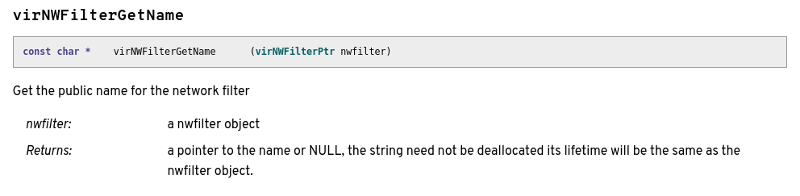

# libvirt-dbus

libvirt-dbus wraps libvirt API to provide a high-level object-oriented API better suited for dbus-based applications

* [Adding an Interface](#adding-an-interface)
    * [Introducing the Interface](#introducing-the-interface)
    * [Implementing Properties](#implementing-properties)
    * [Implementing Connect Methods](#implementing-methods-for-the-connect-interface)
    * [Implementing Interface Methods](#implementing-methods-for-this-interface)
* [Understanding `gdbus.h` in the Context of Interfaces](#understanding-gdbush-in-the-context-of-interfaces)

### Directories
* `data` has the `org.libvirt.Interface.xml` file for every interface
* `src` is all of the source code  
    * contains a `.h` and `.c` file for every interface
    * `gdbus.c` and `connect.c` are key files
* `tests` has the tests

### Building from Source
1. Run `./autogen.sh` which turns the configure file into a script (and maybe runs it?)

2. Running `./configure` generates make files from the make file templates  
These scripts require some packages to run. Install these by running these two commands:
    ```
    $  sudo yum builddep libvirt-dbus
    ```
    * we created a `configuresystem.sh` script to run `./configure` with the appropriate parameters (see [Arbitrary Tasks Reference](reference_arbitrarytasks.md))
3. There are a couple of notable "make" commands:
    * `make` just compiles all of the code
    * `make check` compiles the code and runs the test suite on it
    * `make syntax-check` compiles all the code and checks for variations from coding conventions such as hanging white space etc.

  >**Note:**  
  NEVER run "sudo make" because then all of the make files will require root permissions.  
  Also, NEVER install it, always just run it from source (in this case, the git repo)  

### Adding an Interface

There are three main parts of adding an interface to libvirt-dbus: introducing the interface, implementing the properties, and implementing the methods (in the interface file and in `connect.c`).

Each interface module is laid out in the libvirt documentation (https://libvirt.org/html).

For a given interface, these are the guidelines that I use to identify the properties, interface methods, and connect methods, all of which are represented as functions:

###### Properties
I have attempted to define a property as something with a corresponding method belonging to that interface which contains the word "Get", "Set", or "Is" AND does not take any other pointers or flags as arguments. The first argument must always be an instance of the interface pointer.


The following are all Domain properties:
```
int	virDomainGetAutostart   (virDomainPtr domain, int * autostart)
int	virDomainSetAutostart   (virDomainPtr domain, int autostart)
int	virDomainIsActive       (virDomainPtr dom)
```

###### Connect Methods
The connect methods are easier to identify because they should have "Connect" in the name and their first argument should take a virConnectPtr.

###### Interface Methods
The interface methods are anything that wasn't covered by the last two categories.

#### Introducing the Interface
We will use NWFilter as an example.

1. Create a new file `data/org.libvirt.NWFilter.xml` and add it to `data/Makefile.am`  

    ``` xml
    <!DOCTYPE node PUBLIC "-//freedesktop//DTD D-BUS Object Introspection 1.0//EN"
    "http://www.freedesktop.org/standards/dbus/1.0/introspect.dtd">

    <node name="/org/libvirt/nwfilter">
      <interface name="org.libvirt.NWFilter">
      </interface>
    </node>
    ```

2. Create files `src/nwfilter.c` and `src/nwfilter.h` and add them to `src/Makefile.am`

3. The contents of `src/nwfilter.h` should look like this:

    ``` c
    #pragma once

    #include "connect.h"

    #define VIRT_DBUS_NWFILTER_INTERFACE "org.libvirt.NWFilter"

    void
    virtDBusNWFilterRegister(virtDBusConnect *connect,
                             GError **error);
    ```

4. The contents of `src/nwfilter.c` should look like this:

    ``` c
    #include "nwfilter.h"
    #include "util.h"

    #include <libvirt/libvirt.h>

    static virNWFilterPtr
    virtDBusNWFilterGetVirNWFilter(virtDBusConnect *connect,
                                   const gchar *objectPath,
                                   GError **error)
    {
        virNWFilterPtr nwfilter;

        if (virtDBusConnectOpen(connect, error) < 0)
            return NULL;

        nwfilter = virtDBusUtilVirNWFilterFromBusPath(connect->connection,
                                                      objectPath,
                                                      connect->nwfilterPath);
        if (!nwfilter) {
            virtDBusUtilSetLastVirtError(error);
            return NULL;
        }

        return nwfilter;
    }

    static virtDBusGDBusPropertyTable virtDBusNWFilterPropertyTable[] = {
        { 0 }
    };

    static virtDBusGDBusMethodTable virtDBusNWFilterMethodTable[] = {
        { 0 }
    };

    static gchar **
    virtDBusNWFilterEnumerate(gpointer userData)
    {
        virtDBusConnect *connect = userData;
        g_autoptr(virNWFilterPtr) nwfilters = NULL;
        gint num = 0;
        gchar **ret = NULL;

        if (!virtDBusConnectOpen(connect, NULL))
            return NULL;

        num = virConnectListAllNWFilters(connect->connection, &nwfilters, 0);
        if (num < 0)
            return NULL;

        if (num == 0)
            return NULL;

        ret = g_new0(gchar *, num + 1);

        for (gint i = 0; i < num; i++) {
            ret[i] = virtDBusUtilBusPathForVirNWFilter(nwfilters[i],
                                                       connect->nwfilterPath);
        }

        return ret;
    }

    static GDBusInterfaceInfo *interfaceInfo;

    void
    virtDBusNWFilterRegister(virtDBusConnect *connect,
                             GError **error)
    {
        connect->nwfilterPath = g_strdup_printf("%s/nwfilter",
                                                connect->connectPath);

        if (!interfaceInfo) {
            interfaceInfo = virtDBusGDBusLoadIntrospectData(VIRT_DBUS_NWFILTER_INTERFACE,
                                                            error);
            if (!interfaceInfo)
                return;
        }

        virtDBusGDBusRegisterSubtree(connect->bus,
                                     connect->nwfilterPath,
                                     interfaceInfo,
                                     virtDBusNWFilterEnumerate,
                                     virtDBusNWFilterMethodTable,
                                     virtDBusNWFilterPropertyTable,
                                     connect);
    }
    ```
<deleteme**>

5. In `src/connect.c`, mirror the following changes:

    ``` diff
    @@ -2,6 +2,7 @@
     #include "domain.h"
     #include "events.h"
     #include "network.h"
    +#include "nwfilter.h"
     #include "secret.h"
     #include "storagepool.h"
     #include "util.h"
    ```

    ``` diff
    @@ -1394,6 +1395,7 @@ virtDBusConnectFree(virtDBusConnect *connect)

         g_free(connect->domainPath);
         g_free(connect->networkPath);
    +    g_free(connect->nwfilterPath);
         g_free(connect->secretPath);
         g_free(connect->storagePoolPath);
         g_free(connect);
    ```

    ``` diff
    @@ -1451,6 +1453,10 @@ virtDBusConnectNew(virtDBusConnect **connectp,
         if (error && *error)
             return;

    +    virtDBusNWFilterRegister(connect, error);
    +    if (error && *error)
    +        return;
    +
         virtDBusSecretRegister(connect, error);
         if (error && *error)
             return;
      ```

6. In `src/connect.h`, mirror the following changes:

    ``` diff
    @@ -14,6 +14,7 @@ struct virtDBusConnect {
         const gchar *connectPath;
         gchar *domainPath;
         gchar *networkPath;
    +    gchar *nwfilterPath;
         gchar *secretPath;
         gchar *storagePoolPath;
         virConnectPtr connection;
    ```

7. In `src/util.h`, define the following five functions (this block of code occurs in a series of similar blocks, one for each interface, in alphabetical order):

    ``` c
    virNWFilterPtr
    virtDBusUtilVirNWFilterFromBusPath(virConnectPtr connection,
                                       const gchar *path,
                                       const gchar *nwfilterPath);

    gchar *
    virtDBusUtilBusPathForVirNWFilter(virNWFilterPtr nwfilter,
                                      const gchar *nwfilterPath);

    void
    virtDBusUtilVirNWFilterListFree(virNWFilterPtr *nwfilters);

    G_DEFINE_AUTOPTR_CLEANUP_FUNC(virNWFilter, virNWFilterFree);
    G_DEFINE_AUTOPTR_CLEANUP_FUNC(virNWFilterPtr, virtDBusUtilVirNWFilterListFree);
    ```

8. In `src/util.c`, implement the following three functions (this block of code occurs in a series of similar blocks, one for each interface, in alphabetical order):

    ``` c
    virNWFilterPtr
    virtDBusUtilVirNWFilterFromBusPath(virConnectPtr connection,
                                       const gchar *path,
                                       const gchar *nwfilterPath)
    {
        g_autofree gchar *name = NULL;
        gsize prefixLen = strlen(nwfilterPath) + 1;

        name = virtDBusUtilDecodeUUID(path + prefixLen);

        return virNWFilterLookupByUUIDString(connection, name);
    }

    gchar *
    virtDBusUtilBusPathForVirNWFilter(virNWFilterPtr nwfilter,
                                      const gchar *nwfilterPath)
    {
        gchar uuid[VIR_UUID_STRING_BUFLEN] = "";
        g_autofree gchar *newUuid = NULL;
        virNWFilterGetUUIDString(nwfilter, uuid);
        newUuid = virtDBusUtilEncodeUUID(uuid);
        return g_strdup_printf("%s/%s", nwfilterPath, newUuid);
    }

    void
    virtDBusUtilVirNWFilterListFree(virNWFilterPtr *nwfilters)
    {
        for (gint i = 0; nwfilters[i] != NULL; i++)
            virNWFilterFree(nwfilters[i]);

        g_free(nwfilters);
    }
    ```

    * It appears that the default identifier used here is the UUID. In the case that the interface does not have a UUID property, another unique identifier with a lookup method is used

<deleteme**>
#### Implementing Properties
We will use virNWFilterGetName as an example.

The reference documentation for this function is below for reference:
  
https://libvirt.org/html/libvirt-libvirt-nwfilter.html#virNWFilterGetName


1. Add the corresponding xml to the `org.libvirt.NWFilter.xml` file inside the interface tag alphabetically with the rest of the properties.

    ``` xml
    <node name="/org/libvirt/nwfilter">
      <interface name="org.libvirt.NWFilter">
        <property name="Name" type="s" access="read">
          <annotation name="org.gtk.GDBus.DocString"
            value="See https://libvirt.org/html/libvirt-libvirt-nwfilter.html#virNWFilterGetName"/>
          <annotation name="org.freedesktop.DBus.Property.EmitsChangedSignal" value="const"/>
        </property>
      </interface>
    </node>
    ```
    * all properties are "read" by default unless there is a "Set" method in addition to the get method, in which case it is "readwrite" and the first annotation should reference both links (Domain(Get/Set)Autostart is a good example of implementing these)
    * the second annotation line is required for all types except "b"
    * the type is corresponding to the types of GVariant format strings (https://developer.gnome.org/glib/stable/gvariant-format-strings.html)
        * `b`: gboolean
        * `i`: gint32
        * `u`: guint32
        * `t`: guint64
        * `s`: string

2. Now we need to create a function in `nwfilter.c`. The model for implementing the method is to create a variable for the property and then call the original libvirt function. Each will be slightly different, but if you find a similar function, perhaps for a different interface, that can provide a good model.

    ``` c
    static void
    virtDBusNWFilterGetName(const gchar *objectPath,
                            gpointer userData,
                            GVariant **value,
                            GError **error)
    {
        virtDBusConnect *connect = userData;
        g_autoptr(virNWFilter) nwfilter = NULL;
        const gchar *name;

        nwfilter = virtDBusNWFilterGetVirNWFilter(connect, objectPath, error);
        if (!nwfilter)
            return;

        name = virNWFilterGetName(nwfilter);
        if (!name)
            return virtDBusUtilSetLastVirtError(error);

        *value = g_variant_new("s", name);
    }
    ```

3. The last step is to add a line for the function to the property table (it should be ordered alphabetically). The string is the property name as listed in `org.libvirt.NWFilter.xml`. The second part is the getter function. The last entry is the setter function or NULL if there is none.
    ``` c
    static virtDBusGDBusPropertyTable virtDBusNWFilterPropertyTable[] = {
        { "Name", virtDBusNWFilterGetName, NULL },
        { 0 }
    };
    ```

<deleteme**>

#### Implementing Connect Methods
We will use virConnectListAllNWFilters as an example.

The reference documentation for this function is below for reference:
  

1. Add the corresponding xml to the `org.libvirt.Connect.xml` file inside the interface tag alphabetically with the rest of the methods.

    ``` xml
        <method name="ListNWFilters">
          <annotation name="org.gtk.GDBus.DocString"
            value="See https://libvirt.org/html/libvirt-libvirt-nwfilter.html#virConnectListAllNWFilters"/>
          <arg name="flags" type="u" direction="in"/>
          <arg name="nwfilters" type="ao" direction="out"/>
        </method>
    ```

    * the parameters for the method are defined and explained in the documentation and should be labeled as "in" direction
        * Note: This example is a little tricky because in the documentation, there is an array passed in called "filters"; however, if you read the description you will see that it is just an empty pointer in which to store the results, so we don't have to include it in our in-direction arguments.
    * the name for the "out" direction argument is your choice but it should follow the specs for the return value of the method
        * Note: Since what we really need is the array, that should be the "out" argument
    * the type is corresponding to the types of GVariant format strings (https://developer.gnome.org/glib/stable/gvariant-format-strings.html)
        * `b`: gboolean
        * `i`: gint32
        * `u`: guint32
        * `t`: guint64
        * `a`: array
        * `o`: valid DBus object path
        * `s`: string
        * `&s`: pointer to a string
        * `v`: variant
        * `()`: tuples
        * `{}`: dictionaries

2. Next we need to create a method in `connect.c` which is a wrapper that calls the actual libvirt function. The model for implementing the method is to create a variable for each of the parameters and one for the output. The output is a GVariant, so you will need to use a variant of the `g_variant_new` function. In the example below, a GVariantBuilder is used to form the array output from the method. Each will be slightly different, but if you find a similar function, perhaps for a different interface, that can provide a good model.

    ``` c
    static void
    virtDBusConnectListNWFilters(GVariant *inArgs,
                                 GUnixFDList *inFDs G_GNUC_UNUSED,
                                 const gchar *objectPath G_GNUC_UNUSED,
                                 gpointer userData,
                                 GVariant **outArgs,
                                 GUnixFDList **outFDs G_GNUC_UNUSED,
                                 GError **error)
    {
        virtDBusConnect *connect = userData;
        g_autoptr(virNWFilterPtr) nwfilters = NULL;
        guint flags;
        GVariantBuilder builder;
        GVariant *gnwfilters;

        g_variant_get(inArgs, "(u)", &flags);

        if (!virtDBusConnectOpen(connect, error))
            return;

        if (virConnectListAllNWFilters(connect->connection, &nwfilters, flags) < 0)
            return virtDBusUtilSetLastVirtError(error);

        g_variant_builder_init(&builder, G_VARIANT_TYPE("ao"));

        for (gint i = 0; nwfilters[i]; i++) {
            g_autofree gchar *path = NULL;
            path = virtDBusUtilBusPathForVirNWFilter(nwfilters[i],
                                                     connect->nwfilterPath);

            g_variant_builder_add(&builder, "o", path);
        }

        gnwfilters = g_variant_builder_end(&builder);
        *outArgs = g_variant_new_tuple(&gnwfilters, 1);
    }
    ```

3. The last step is to add a line for the function to the connect method table (it should be ordered alphabetically). The string is the method name as listed in `org.libvirt.Connect.xml`. The other half of the line is the method you just created which is what should be actually called when someone invokes the function name.
    ``` c
    static virtDBusGDBusMethodTable virtDBusConnectMethodTable[] = {
        ...
        { "ListNWFilters", virtDBusConnectListNWFilters },
        ...
        { 0 }
    };
    ```


<deleteme**>

#### Implementing Interface Methods

************************************************************************
************************************************************************
************************************************************************
************************************************************************
************************************************************************
************************************************************************
************************************************************************
************************************************************************
************************************************************************
************************************************************************

### Understanding `gdbus.h` in the Context of Interfaces

``` c
#pragma once

#include <gio/gio.h>
```
>The typedef below essentially is defining a class of function outlining an interface method. When implementing a function of this type, if a parameter is unused, it is followed by the G_GNUC_UNUSED attribute annotation.

``` c
/**
 * virtDBusGDBusMethodFunc:
 * @inArgs: input arguments of the method call
 * @inFDs: list of input file descriptors
 * @objectPath: the object path the method was called on
 * @userData: user data passed when registering new object or subtree
 * @outArgs: return location of output arguments
 * @outFDs: return location of output file descriptors
 * @error: return location for error
 *
 * Handles D-Bus method call.  In case of error the handler has
 * to set an @error.
 */
typedef void
(*virtDBusGDBusMethodFunc)(GVariant *inArgs,
                           GUnixFDList *inFDs,
                           const gchar *objectPath,
                           gpointer userData,
                           GVariant **outArgs,
                           GUnixFDList **outFDs,
                           GError **error);
```
>The typedef below essentially is defining a class of function outlining an interface GetProperty method.

``` c
/**
 * virtDBusGDBusPropertyGetFunc:
 * @objectPath: the object path the method was called on
 * @userData: user data passed when registering new object or subtree
 * @value: return location for property value
 * @error: return location for error
 *
 * Handles D-Bus Get action on a property.  In case of error the handler
 * has to set an @error, otherwise @value has to be set.
 */
typedef void
(*virtDBusGDBusPropertyGetFunc)(const gchar *objectPath,
                                gpointer userData,
                                GVariant **value,
                                GError **error);
```
>The typedef below essentially is defining a class of function outlining an interface SetProperty method.

``` c
/**
 * virtDBusGDBusPropertySetFunc:
 * @objectPath: the object path the method was called on
 * @value: new value that should be set to the property
 * @userData: user data passed when registering new object or subtree
 * @error: return location for error
 *
 * Handles D-Bus Set action on a property.  In case of error the handler
 * has to set an @error.
 */
typedef void
(*virtDBusGDBusPropertySetFunc)(GVariant *value,
                                const gchar *objectPath,
                                gpointer userData,
                                GError **error);
```
>The typedef below essentially is defining a class of function outlining an interface Enumerate method.

``` c
/**
 * virtDBusGDBusEnumerateFunc:
 * @userData: user data passed when registering new subtree
 *
 * Handles D-Bus introspection for subtree of objects.
 *
 * Returns a list of objects or NULL.
 */
typedef gchar **
(*virtDBusGDBusEnumerateFunc)(gpointer userData);
```
>The virtDBusGDBusMethodTable is defining a struct. There is an instance of this struct for every interface (including connect). The table contains an entry for every method belonging to that interface.

``` c
struct _virtDBusGDBusMethodTable {
    const gchar *name;
    virtDBusGDBusMethodFunc methodFunc;
};
typedef struct _virtDBusGDBusMethodTable virtDBusGDBusMethodTable;
```
>The virtDBusGDBusPropertyTable is defining a struct. There is an instance of this struct for every interface (including connect). The table contains an entry for every property belonging to that interface.

``` c
struct _virtDBusGDBusPropertyTable {
    const gchar *name;
    virtDBusGDBusPropertyGetFunc getFunc;
    virtDBusGDBusPropertySetFunc setFunc;
};
typedef struct _virtDBusGDBusPropertyTable virtDBusGDBusPropertyTable;
```
>Not really sure what these two typedefs below mean with regards to interfaces

``` c
typedef guint virtDBusGDBusSource;
typedef guint virtDBusGDBusOwner;
```
>The specification seems to explain the function below pretty well. This only has one implementation and takes interface-specific parameters.

``` c
/**
 * virtDBusGDBusLoadIntrospectData:
 * @interface: name of the interface
 * @error: return location for error
 *
 * Reads an interface XML description from file and returns new
 * interface info.  The caller owns an reference to the returned info.
 *
 * The file path is constructed as:
 *
 *  VIRT_DBUS_INTERFACES_DIR/{@interface}.xml
 *
 * Returns interface info on success, NULL on failure.
 */
GDBusInterfaceInfo *
virtDBusGDBusLoadIntrospectData(gchar const *interface,
                                GError **error);
```
>This function below is called by `connect.c` before it calls each of the interface-specific Register functions.

``` c
/**
 * virtDBusGDBusRegisterObject:
 * @bus: GDBus connection
 * @objectPath: object path
 * @interface: interface info of the object
 * @methods: table of method handlers
 * @properties: table of property handlers
 * @userData: data that are passed to method and property handlers
 *
 * Registers a new D-Bus object that we would like to handle.
 */
void
virtDBusGDBusRegisterObject(GDBusConnection *bus,
                            gchar const *objectPath,
                            GDBusInterfaceInfo *interface,
                            virtDBusGDBusMethodTable *methods,
                            virtDBusGDBusPropertyTable *properties,
                            gpointer userData);
```
>This function below is called within the virtDBus<Interface>Register function which exists for all interfaces. Its arguments define the interface-specific objects created in the introduction of the interface such as the enumerate function and the method and property tables.

``` c
/**
 * virtDBusGDBusRegisterSubtree:
 * @bus: GDBus connection
 * @objectPath: object prefix path
 * @interface: interface info of the object
 * @methods: table of method handlers
 * @properties: table of property handlers
 * @userData: data that are passed to method and property handlers
 *
 * Registers a new D-Bus object prefix that we would like to handle.
 */
void
virtDBusGDBusRegisterSubtree(GDBusConnection *bus,
                             gchar const *objectPath,
                             GDBusInterfaceInfo *interface,
                             virtDBusGDBusEnumerateFunc enumerate,
                             virtDBusGDBusMethodTable *methods,
                             virtDBusGDBusPropertyTable *properties,
                             gpointer userData);
```
>I don't think the rest of the file is relevant with regards to interfaces.

``` c
/**
 * virtDBusGDBusPrepareThreadPool:
 * @maxThreads: the number of maximum threads in thread pool
 * @error: return location for error or NULL
 *
 * Initializes thread pool to be used to process D-Bus messages.
 *
 * Returns TRUE on success, FALSE on error and sets @error.
 */
gboolean
virtDBusGDBusPrepareThreadPool(gint maxThreads,
                               GError **error);

G_DEFINE_AUTO_CLEANUP_FREE_FUNC(virtDBusGDBusSource, g_source_remove, 0);
G_DEFINE_AUTO_CLEANUP_FREE_FUNC(virtDBusGDBusOwner, g_bus_unown_name, 0);

```
